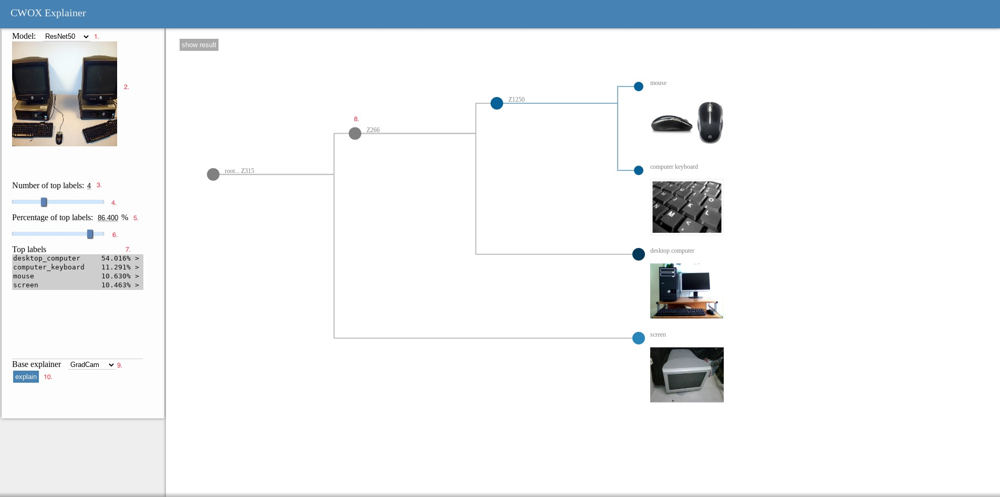
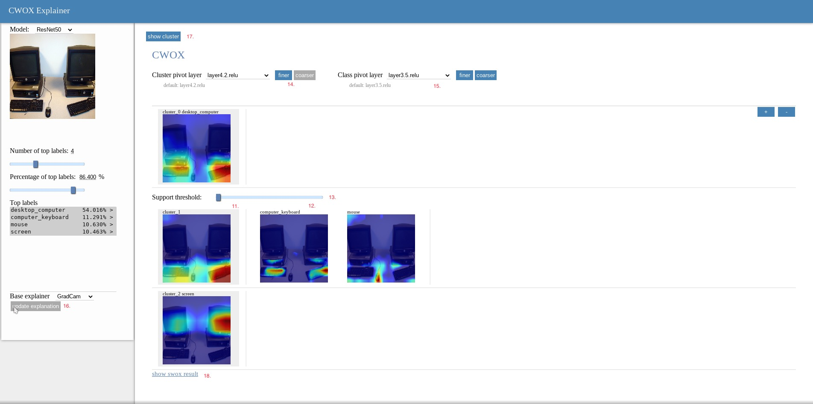

# CWOX Explainer: Application to Perform the Contrastive Whole-out Explanation Process

This is a document about the usage of our CWOX Explainer.

## Server side

### Requirements

Make sure you have cuda available on your machine if your are going to serve it locally.

* lime
* torchvision
* torchray
* flask
* Flask-Session

### Installation

1. download the code from our github page.

   ``` 
   $ git clone https://github.com/HKUST-HUAWEI-XAI/CWOX.git
   $ cd CWOX/CWOX_Explainer
   ```

2. create a virtualenv of python and install the requirements.

   ```
   $ python -m venv .venv
   $ source .venv/bin/activate
   $ pip install -r requirements.txt
   ```

### Launch the back-end

   ```
   $ source .venv/bin/activate
   $ ./run.sh
   ```

   

## Browser side

 

### Get result of classification

1. select to a classifier; available options: googlenet and resnet50.

2. click or drag here to choose an image file for classification; The result will be automatically loaded and a dendrogram will be generated from top labels on the right.

### Adjust explanation configuration

3. type in number of top classes to explain. (optional, synchronized with 5,6,7)

4. slide to change the number of top classes to explain. (optional, synchronized with 4,6,7)

5. type in percentage of top classes to explain. (optional, synchronized with 4,5,7)

6. slide to change the percentage of top classes to explain. (optional, synchronized with 4,5,6)

7. click to remove some unwanted top classes or add it back by clicking again.

8. by default, a dendrogram is generated from selected top classes. If necessary, click a higher latent node to merge clusters or click lower node to undo a made merge.

9. choose the base explainer; available options: grad-cam, lime, mwp and rise.

10. click explain to get cwox explanation.

### check the explanation



11. heatmaps for clusters, highlighted with gray background, arranged into rows with heatmaps of corresponding classes followed.

12. heatmaps of top classes within the cluster indicated by the first heatmap in this row.

13. a threshold value control the threshold of cluster heatmap to mask area of attention in followed heatmaps of corresponding classes.

14. layer of cluster heatmaps for explanation, available for base explainer support layers (grad-cam and mwp).

15. layer of class heatmaps for explanation, available for base explainer support layers (grad-cam and mwp).
16. update the explanation. Highlighting indicating current result may outdated due to configuration change made.
17. go back to the dendrogram page to adjust clusters.
18. check the pure base explainer result, for comparison.
