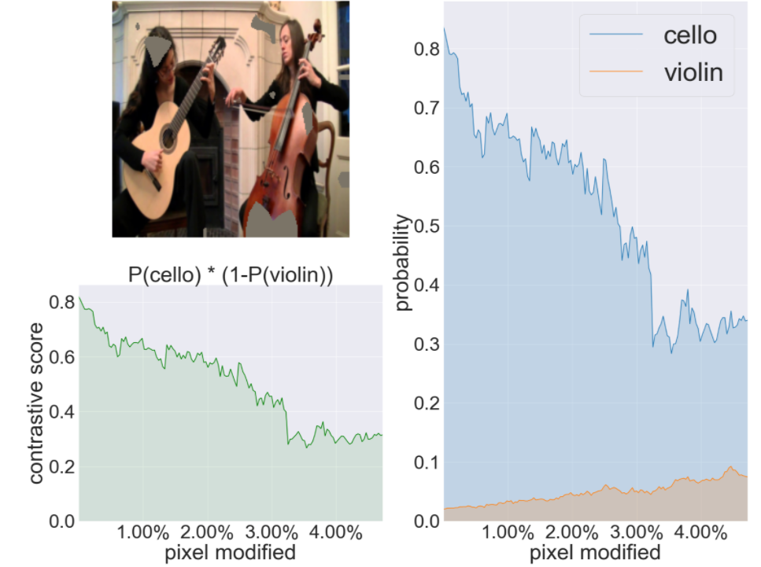

## Evaluation Metrics for Contrastive Explanation: Contrastive AUC

 This repository is a pytorch implementation of the **Evaluation Metrics** for measuring **Contrastive Faithfulness**  in the field of **Image Classification**.

### 1. Definition

Suppose that the model  has reasons to believe that an input  belongs to a class , but cannot rule out the possibility that it might belong to some other classes . If a heatmap  is contrastively faithful to , then it should give high values to the pixels that  considers positive evidence for  and negative evidence . The deletion of such
high-value pixels should lead to a decrease in the probability of   and an increase in the probability of .

To be more specific, let there be totally n pixels, and  be an enumeration of all the pixels in descending order of }). Let  be the result of deleting the first  pixels from the input . By deleting a pixel, we mean replacing its RGB values with the mean pixel RGB values (0.485, 0.456 0.406) of ImageNet. If  is contrastively faithful to , then the probability ) would decrease with r and the probability ) would increase with it. Consequently, the **Contrastive Score** =P_{m}(\mathbf{c}|\mathbf{x}_{[r,n]})(1-P_{m}(\mathbf{{C}'}|\mathbf{x}_{[r,n]}))) would decrease with r.

We propose two quantitative metrics namely 
**Contrastive AUC (CAUC)** and **Weighted Drop in Contrastive Score (CDROP)** based on *Contrastive Score* to evaluate the contrastively faithfulness of a heatmap to the target model. The definitions for them are given below. We argue that the attention of a human user is primarily focused on the salient pixels of a heatmap. When evaluating a heatmp , we consider only the the -salient pixels, i.e., the number of pixels such that \geq&space;\delta&space;max_{x}H(x)). In our experiment, we set . 


**Contrastive AUC (CAUC)**


=\frac{1}{n}\sum_{r=1}^{n_{\delta}}s(r)).

The smaller the *CAUC*, the more contrastively faithful  is to .
  
**Weighted Drop in Contrastive Score (CDROP)**


=\frac{s(1)-s(n_{\delta}&plus;1)}{log_{2}(1&plus;max\[n_{\delta},\tau\]/\tau)}),


where  is a hyperparameter, which is set at  in our experiments. The score is a combination of two factors. The first is the drop in the contrastive score due to the deletion of all the salient pixels. The second is a logarithmic penalty factor for large . It aims to capture the intuition that too many salient pixels can be distracting to a human user. Larger *CDROP* scores indicate better heatmaps.


### 2. Note on the parameters of the function

<sub><sup>model (nn.Module): Black-box model being explained.</sub></sup>

<sub><sup>metric(list or string): 'CDROP' or 'CAUC' or ['CDAOP','CAUC']</sub></sup>

<sub><sup>step(int):number of pixels to be erased in each step. For effectiveness, we erase a group of pixels at each step instend of only one step.</sub></sup>

<sub><sup>batch_size (int): run n modifications at once (user can decide it according to the RAM, larger batch size-->the evaluation can run faster.</sub></sup>

<sub><sup>delta (float): The delta for stoping the loop. When evaluating a heatmp , we consider only the -salient pixels, i.e., the number of pixels such that \geq&space;\delta&space;max_{x}H(x)). The defalut setting . </sub></sup>

<sub><sup>tau_threshold(float): The threshold to penalize the CDROP score, where . The defalut setting .</sub></sup>

<sub><sup>smooth_len(int): Size of sliding window. For robustness, we smooth ) using sliding window while computing CDROP score. Default size is 3.</sub></sup>

```python
from evaluation.causal import CausalMetric
metric_type = ['CAUC', 'CDROP']
metric = CausalMetric(model=model_eval,metric=metric_type, step = 16, batch_size = 8,delta = 0.5,tau_thres=0.05,smooth_len=3)
```

### 3. Usage and Example (can also see the [*example.py*](https://github.com/vaynexie/CWOX/blob/main/Evaluation/example.py))

We show an example to evaluate one of the CWOX explanation results for an image with Grad-CAM as base explainer using ResNet50. 

```python
#-------------------Load the Package and Define needed Function-------------------
import torch,torchvision
import numpy as np 
from evaluation.utils import read_tensor
from evaluation.causal import CausalMetric, visual_evaluation
from evaluation.common import Explanation
import matplotlib.pyplot as plt

device = "cuda" if torch.cuda.is_available() else "cpu"

def normalize(x):
    x = x.clip(0) / x.max()
    x[x.isnan()] = 0
    return x

def load_example():
    img = read_tensor(img_path)
    img = img.to(device)
    model_eval = torchvision.models.resnet50(pretrained = True)
    model_eval.to(device)
    model_eval.eval()
    return model_eval, img
```

```python
#-------------------Load the Example and Explanation-------------------
'''
The image 'cello_guitar.jpg' can be found in eval_image: https://github.com/vaynexie/CWOX/tree/main/eval_image

ResNet50 Top 5 prediction classes for cello_guitar.jpg:
cello(0.839), acoustic-guitar (0.081), banjo (0.036), violin (0.021), electric-guitar (0.008)

Confusion Cluster information by HLTM: [[486,889],[402,420,546]] 
i.e. Cluster 1: cello, violin; Cluster 2: acoustic guitar, banjo, electric guitar.

cello.npy: CWOX results on cello_guitar example with Grad-CAM as base explainer
It is a dictionary with keys-486:cello, 889-violin,402-acoustic guitar,420-banjo,546-electric guitar; the value is the contrastive saliency heatmap for corresponding class
'''

img_path='cello_guitar.jpg'
sal_dict_Grad_CAM=np.load('cello.npy',allow_pickle=True).item()
model_eval, img11 = load_example()
# We evaluate on the cello heatmap now. Since we select the target class as 486-cello, the contrastive classs is 889-violin
check_ind=486
check_neg_ind=[889]
# Load the cello heatmap
saliency_used=sal_dict_Grad_CAM[check_ind]
```

```python
#-------------------Define the metric-------------------
metric_type = ['CAUC', 'CDROP']
# delta (float): the delta for stoping the loop.
# tau_threshold(float): the threshold to penalize the CDROP score, where \tau=tau_threshold*Number of all pixels in the image
# smooth_len(int): For robustness, we smooth s(n_{\delta}+1) using a default sliding window of size 3.
# CDROP(H,m|x,c,C')=\frac{s(1)-s(n_{\delta}+1)}{log_{2}(1+max\{n_{\delta},\tau\}/\tau)}
metric = CausalMetric(model=model_eval,metric=metric_type, step = 16, batch_size = 8,delta = 0.5,tau_thres=0.05,smooth_len=3)
saliency_used_tensor=torch.tensor(saliency_used,dtype=torch.float64).to(device) 
norm_saliency_used_tensor = normalize(saliency_used_tensor)
explain_contrast = Explanation(target = [[check_ind], check_neg_ind], saliency = norm_saliency_used_tensor)
```

```python
#------------------Run Evaluation with plotting and printing the result-------------------
from pylab import rcParams
rcParams['figure.figsize'] = 25, 20
show_vis = True
if show_vis:
    res, count = metric.single_run(img11, explain_contrast, visual_evaluation)
else:
    res, count = metric.single_run(img11, explain_contrast)

for i in res:
    print(str(i)+':'+str(res[i].cpu().item()))
plt.show()
```

Result:

CAUC:0.023687757551670074
CDROP:0.505013108253479





